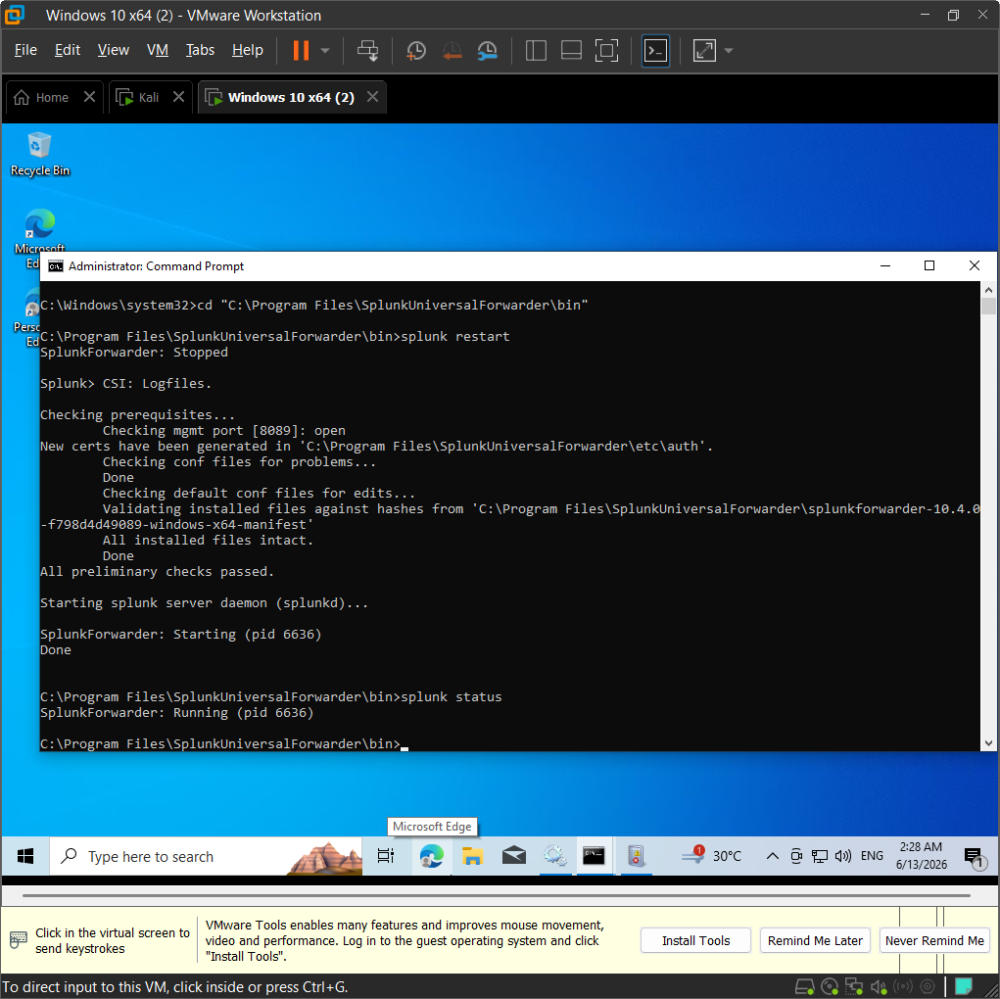
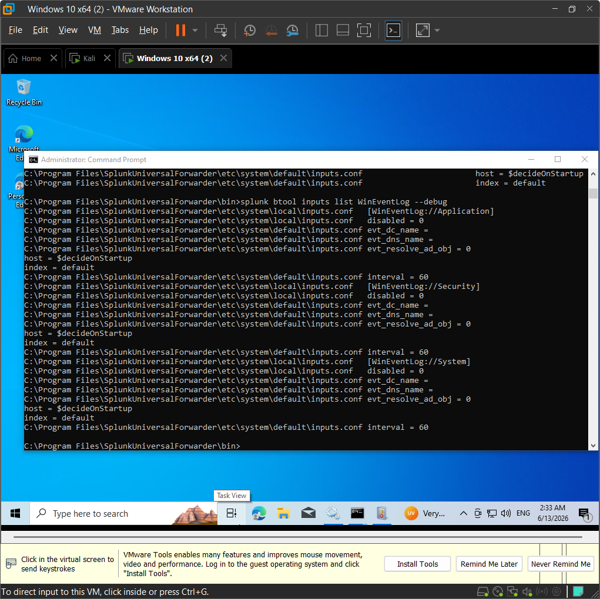
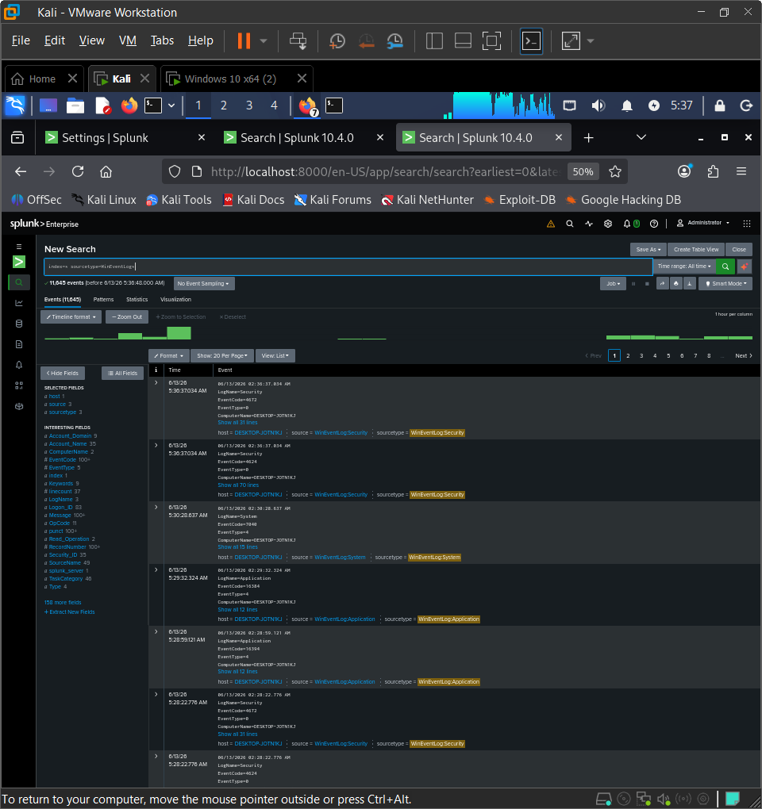
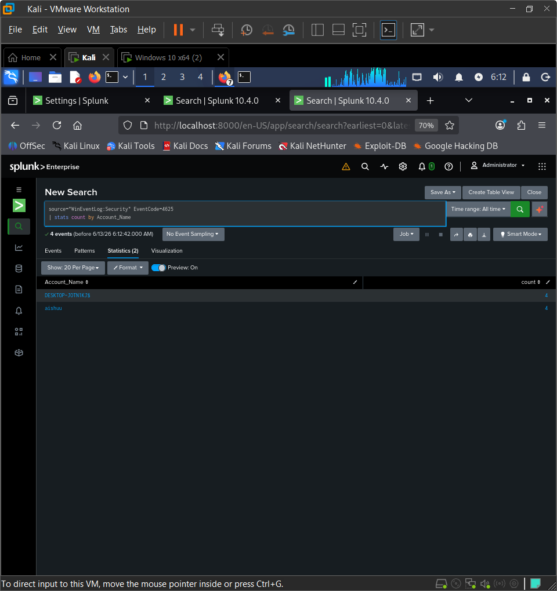
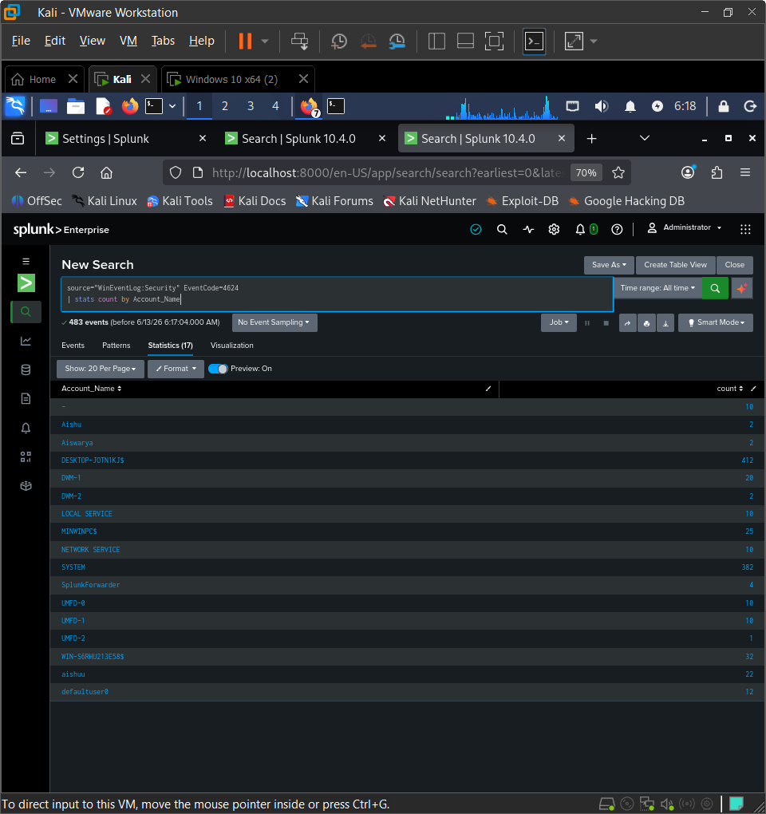
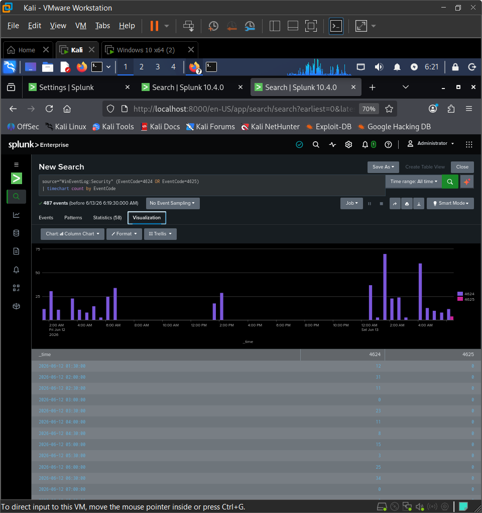
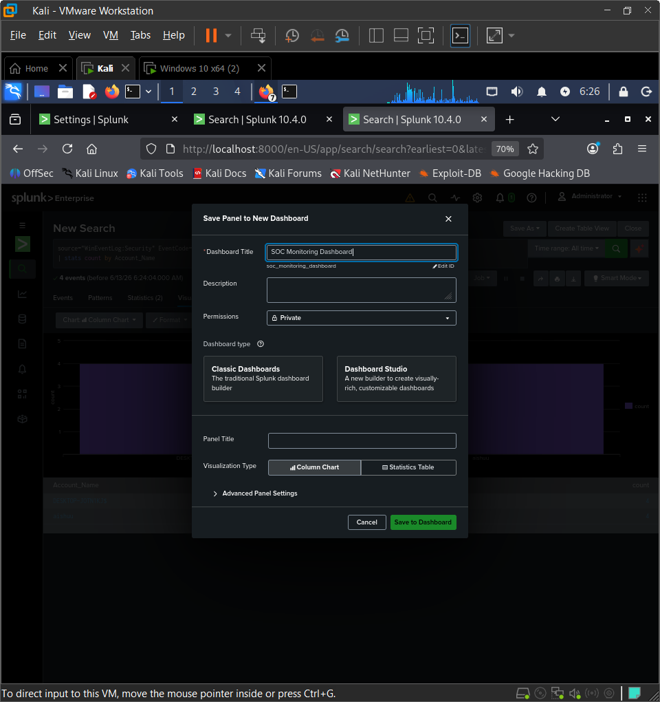
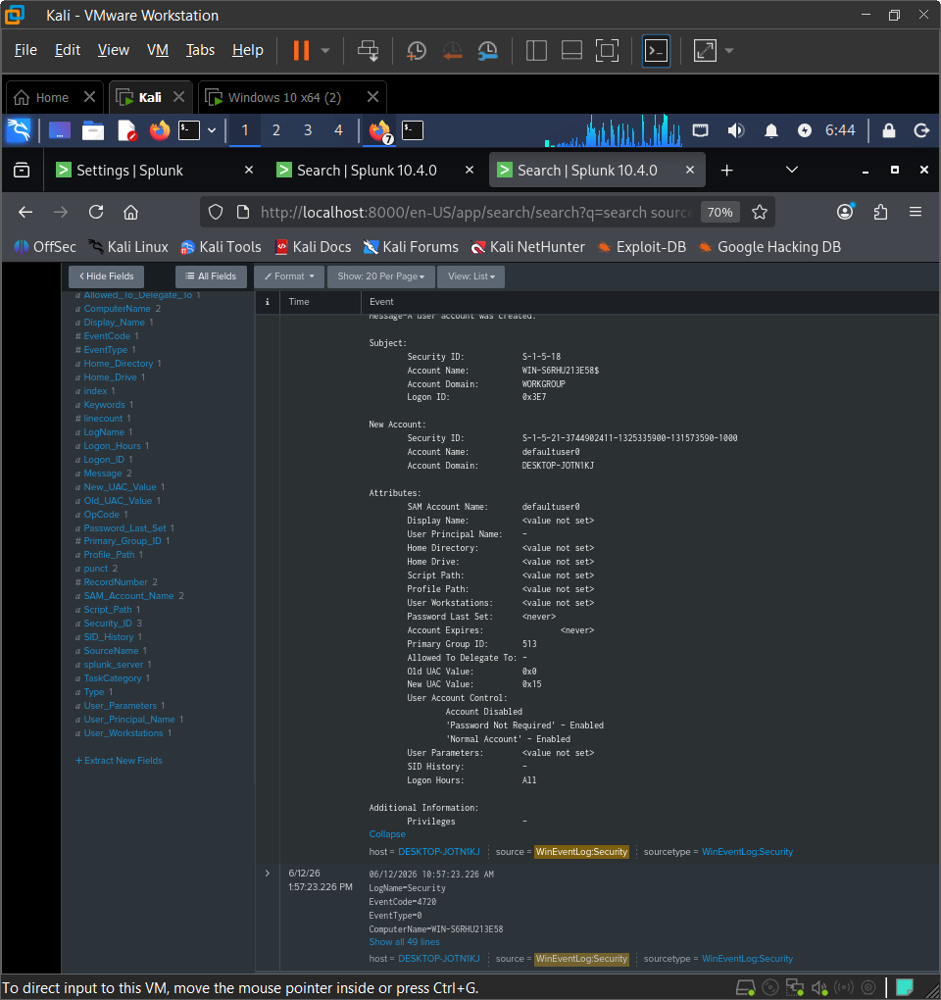
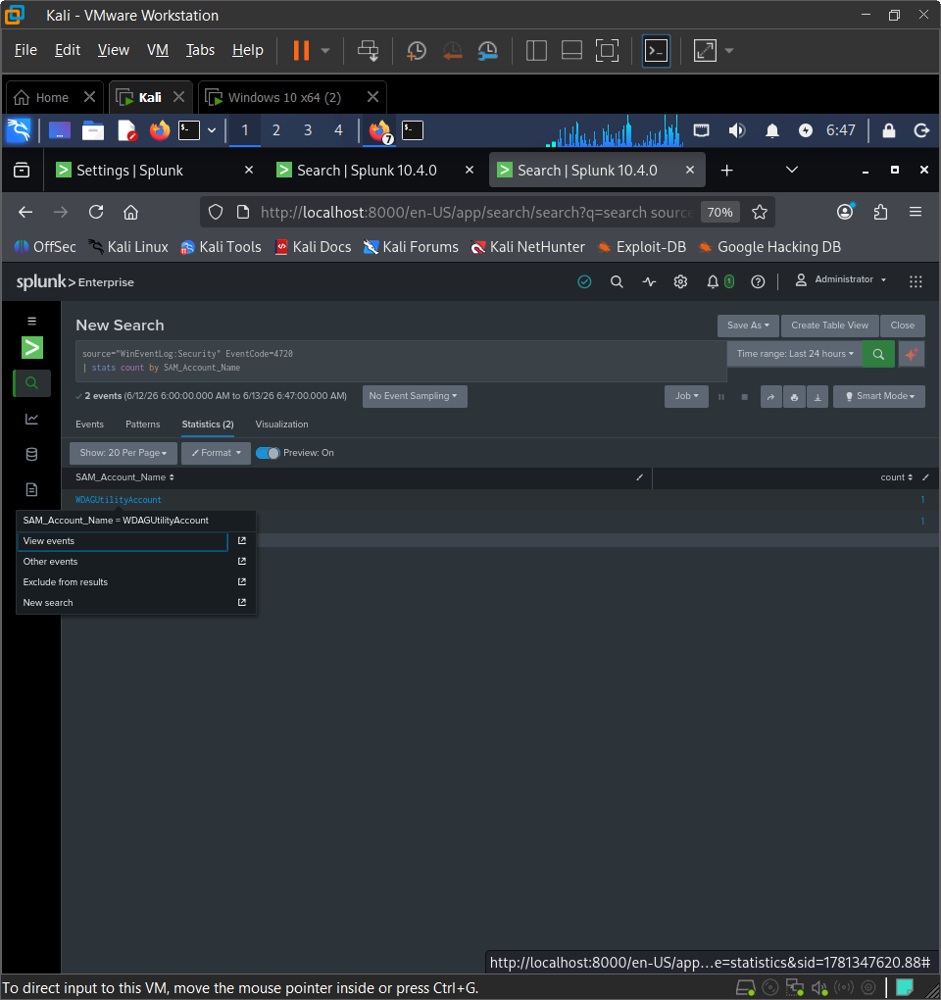
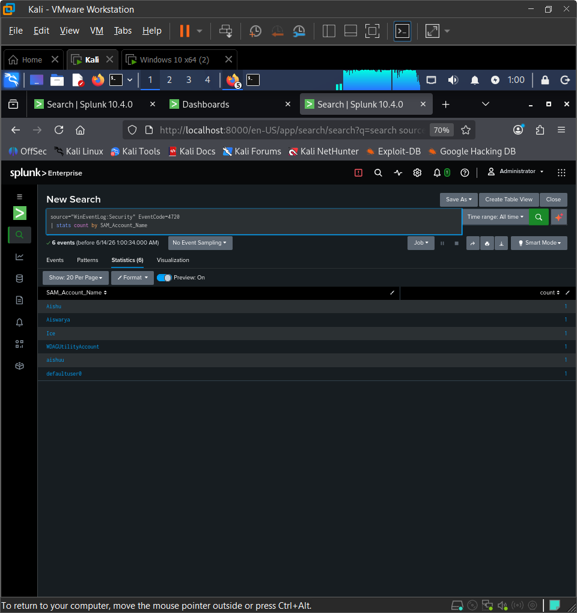

# Security Event Monitoring and Threat Detection using Splunk

## Project Overview

Designed and implemented a Security Operations Center (SOC) monitoring lab using Splunk Enterprise to collect, analyze, and visualize Windows security events. The project focuses on real-time security monitoring, threat detection, user activity analysis, and dashboard-based incident visibility.

## Objectives

- Centralize Windows security logs in Splunk.
- Monitor authentication activities.
- Detect suspicious login attempts.
- Track user account creation events.
- Visualize security events through dashboards.
- Gain hands-on SOC analyst experience.

## Environment Setup

### Operating Systems
- Kali Linux
- Windows 10

### Tools Used
- Splunk Enterprise
- Splunk Universal Forwarder
- VMware Workstation
- Windows Event Logs

## Project Implementation

### 1. Splunk Enterprise Deployment
- Installed and configured Splunk Enterprise on Kali Linux.
- Verified Splunk services and web interface accessibility.

### 2. Log Collection Configuration
- Installed Splunk Universal Forwarder on Windows 10.
- Configured forwarding of:
  - Security Logs
  - System Logs
  - Application Logs

### 3. Data Ingestion Verification
- Verified successful ingestion of Windows Event Logs into Splunk.
- Confirmed communication between Universal Forwarder and Splunk Indexer.

### 4. Failed Login Detection
- Monitored Event ID 4625.
- Identified unsuccessful login attempts.
- Generated statistical analysis of failed authentication events.

### 5. Successful Login Monitoring
- Analyzed Event ID 4624.
- Monitored successful user logins.
- Created login activity statistics and visualizations.

### 6. User Account Creation Detection
- Tracked Event ID 4720.
- Detected newly created user accounts.
- Investigated account creation activities for security monitoring.

### 7. Security Dashboard Development
- Built a SOC Monitoring Dashboard.
- Added visualizations for:
  - Failed Login Attempts
  - User Logon Statistics
  - Account Creation Monitoring
  - Security Event Trends

## Key Skills Demonstrated

- SIEM Operations
- Splunk Search Processing Language (SPL)
- Security Event Monitoring
- Log Analysis
- Threat Detection
- Windows Event Analysis
- Dashboard Creation
- Incident Investigation
- Security Operations Center (SOC) Fundamentals

## Screenshots

### 1. Splunk Forwarder Running

### 2. WinEventLog Inputs Configured

### 3. Data Ingestion Confirmed

### 4. Failed Login Analysis

### 5. User Logon Statistics

### 6. Login Spike Visualization

### 7. SOC Dashboard Creation

### 8. Account Creation Event Detail

### 9. User Account Creation Detection

### 10. User Creation Events

## Outcome

Successfully implemented a SOC monitoring environment capable of collecting Windows security logs, detecting authentication-related events, monitoring account creation activities, and visualizing security data through Splunk dashboards.
